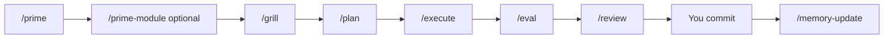

# cursor-workflow

A **Cursor AI workflow** you can drop into any project: slash-command skills, durable memory, and hooks that run automatically. No vendor lock-in to a specific stack — works with Node, Python, Go, Rails, Laravel, or anything else.

Think of it as a daily rhythm for building with AI: **orient → clarify → plan → build → verify → review → learn**.

---

## What you get

| Piece | What it does |
|---|---|
| **Skills** (`/grill`, `/plan`, …) | Repeatable workflows you trigger in chat |
| **Rules** (`.cursor/rules/*.mdc`) | Short constraints Cursor loads when you edit matching files |
| **Memory** (`memory/features/`, `AGENTS.md`) | Knowledge that survives across sessions |
| **Hooks** | Session start context, session logs, commit hygiene, **maintain-memory** queue |

Want the quick payoff first? Open `sample/README.md` for a runnable contact-form demo plus example artifacts from every workflow skill.

## Architecture

Cursor discovers project-specific AI behavior from an app repo's `.cursor/` directory. This workflow can supply that directory in two ways: either by symlinking `.cursor` to a central `cursor-workflow/projects/<project>` folder, or by copying those files directly into the app repo.

The moving parts are:

| Layer | Location | Purpose |
|---|---|---|
| **App code** | your app repo | Product source, tests, migrations, package files, etc. |
| **Project workflow** | `.cursor/` in the app repo, or `cursor-workflow/projects/<project>` when symlinked | Project skills, rules, docs, plans, feature memory, and hook state |
| **Shared workflow engine** | `cursor-workflow/hooks/`, `templates/`, `skills-cursor/` | Reusable hooks, scaffolds, and authoring skills |
| **Local learned memory** | `AGENTS.md` in the app repo | Cross-cutting conventions maintained by `/maintain-memory` |

Why symlinks exist: they let one version-controlled workflow repo serve many app repos while keeping app git history focused on product code. The app still has `.cursor`, but it points to `cursor-workflow/projects/<project>` instead of storing the files physically in the app repo.

How the pieces relate:

- **Skills** are slash-command workflows such as `/prime`, `/prime-module`, `/grill`, `/plan`, and `/execute`.
- **Rules** are short Cursor instructions in `.cursor/rules/*.mdc`; `000-project-context.mdc` is always loaded.
- **Docs and memory** give skills deeper project context on demand, usually under `.cursor/docs/` and `.cursor/memory/`.
- **Hooks** run automatically on session and shell events. They surface context, append session notes, queue maintain-memory work, and guard commits in this workflow repo.

---

## Choose an install mode

### Mode 1: central workflow repo with `.cursor` symlink

Use this when you want all project workflow files and memories in one central repo. This is the default.

```bash
git clone https://github.com/YOUR_USER/cursor-workflow.git ~/cursor-workflow
cd ~/cursor-workflow

# Preview
./install.sh --dry-run

# Wire global hooks + symlink projects/example → your app's .cursor
APP_ROOT=~/code/my-app PROJECT=example ./install.sh --apply

# Restart Cursor completely (Cmd+Q, reopen)
```

Result:

```text
my-app/
├── src/ ...
├── AGENTS.md
└── .cursor  ->  ~/cursor-workflow/projects/example
```

The installer adds `.cursor` to `my-app/.git/info/exclude`, so the symlink stays local and app git does not try to commit it. If you also want learned `AGENTS.md` patterns to stay local, add `AGENTS.md` to the app repo's `.gitignore`.

### Mode 2: copy workflow files into the app repo

Use this when the app repo should own and commit its Cursor workflow directly. No `.cursor` symlink is created.

```bash
git clone https://github.com/YOUR_USER/cursor-workflow.git ~/cursor-workflow
cd ~/cursor-workflow

# Preview
APP_ROOT=~/code/my-app PROJECT=example ./install.sh --mode copy --dry-run

# Copy project skills/rules/docs/memory plus hook scripts into my-app/.cursor
APP_ROOT=~/code/my-app PROJECT=example ./install.sh --mode copy --apply

# Restart Cursor completely (Cmd+Q, reopen)
```

Result:

```text
my-app/
├── src/ ...
├── .gitignore
├── AGENTS.md
└── .cursor/
    ├── hooks.json
    ├── hooks/
    ├── rules/
    ├── skills/
    ├── docs/
    └── memory/
```

The installer keeps `.cursor/` trackable, but adds volatile local state to `.gitignore`: `.cursor/hooks/state/maintain-memory-pending.jsonl`, `.cursor/memory/sessions/`, and `AGENTS.md`.

### Customize for your project

```bash
cp -r projects/example projects/my-app
# Edit projects/my-app/rules/000-project-context.mdc (stack, conventions)
APP_ROOT=~/code/my-app PROJECT=my-app ./install.sh --apply
```

For direct-copy mode, use the same project slug with `--mode copy`:

```bash
APP_ROOT=~/code/my-app PROJECT=my-app ./install.sh --mode copy --apply
```

---

## Your daily loop

Type these in Cursor chat, in order, for any non-trivial task:

```
/prime        →  where are we? (git, open work)
/prime-module →  deep-dive one area (rules, docs, git, memory, prior plans)
/grill        →  clarify requirements (7 questions → brief file)
/plan         →  implementation plan + test gates
/execute      →  code changes, test after each task
/eval         →  does it actually meet success criteria?
/review       →  4 specialist reviewers on your diff
YOU commit    →  you run git, not the agent
/memory-update → after deploy: update feature memory
/maintain-memory → promote session learnings to AGENTS.md
```



**Hooks run in the background:**

- **sessionStart** — lists docs and skills available this session
- **sessionEnd** — appends a line to `memory/sessions/YYYY-MM-DD.md`
- **stop → maintain-memory** — queues the session transcript and prompts you to run `/maintain-memory`
- **beforeShellExecution** — on commits *inside cursor-workflow only*, requires a `Context:` section with bullets (keeps harness commits auditable)

---

## See the value right away

The `sample/` folder is a complete tour:

- `sample/tiny-contact-app/` is a tiny JavaScript contact form with a duplicate-submit test.
- `sample/workflow-artifacts/00-skill-map.md` lists every skill/agent this repo offers.
- `sample/workflow-artifacts/01-prime.md` through `10-maintain-memory.md` show the artifacts and decisions produced by the full loop.

Run the sample app:

```bash
cd sample/tiny-contact-app
npm test
```

Or install the workflow into the sample app:

```bash
APP_ROOT="$PWD/sample/tiny-contact-app" PROJECT=example ./install.sh --mode copy --apply
```

Then restart Cursor, open `sample/tiny-contact-app`, and try `/prime`, `/prime-module api`, and `/grill fix duplicate contact form emails`.

---

## Example: fix duplicate contact-form emails

Anyone who has built a web app has seen this: the contact form works, but users sometimes get **two confirmation emails** after one submit. Here’s the full workflow on that bug — no framework assumed beyond “you have a form and a mailer.”

### 1. Orient (~1 min)

Open your app in Cursor. In chat:

```
/prime
/prime-module api
```

`/prime` reads recent commits and summarizes what’s in flight. If the bug is clearly in one area (API, auth, billing), add `/prime-module <slug>` — slug matches a file in `.cursor/rules/` (example: `api` → `api.mdc`). You say:

> Fix duplicate confirmation emails on the contact form.

### 2. Interrogate (~5 min)

```
/grill fix-duplicate-contact-email
```

The agent walks **7 categories** (one question at a time):

1. **Problem** — “Users get two identical confirmation emails after one submit.”
2. **Success criteria** — “Exactly one email per successful form submission.”
3. **Scope IN** — idempotency on send; test for double-submit.
4. **Scope OUT** — not changing email copy or admin notification routing.
5. **Code impact** — `ContactController`, mail service, maybe the frontend submit handler.
6. **Risks** — over-aggressive dedup blocks legitimate resends.
7. **Rollback** — revert PR; dedup table is additive.

When you’re satisfied:

```
ENOUGH
```

It writes `plans/fix-duplicate-contact-email.brief.md` in your workflow repo.

### 3. Plan (~3 min)

```
/plan
```

Four explore sub-agents run in parallel: which files change, which tests exist, prior bugs in `memory/features/contact-form/`. You get `plans/fix-duplicate-contact-email.plan.md` with tasks like:

- Task 1: Add idempotency key column + migration
- Task 2: Guard send in mail service
- Task 3: Test double POST returns one email

Each task lists a **test command** (`npm test`, `pytest`, etc. — you set this in your Tier-1 rule).

### 4. Build (~15 min)

```
/execute
```

The agent edits files, runs tests after **each** task, and writes `execution-report.md`. It does **not** commit.

### 5. Verify outcome (~2 min)

```
/eval
```

Tests might pass while the product still fails (e.g. test only covers single click, not double-click). `/eval` checks the brief’s success criteria and writes PASS/FAIL per criterion.

### 6. Review (~3 min)

```
/review
```

Four reviewers (correctness, tests, security, maintainability) scan `git diff`. You fix anything critical, then **you** commit:

```bash
git add .
git commit -m "fix: dedupe contact form confirmation emails"
git push
```

### 7. Learn (after deploy)

```
/memory-update
```

Appends to `memory/features/contact-form/changelog.md` and `lessons.md`:

> Double-submit + API retry both hit the mailer — use an idempotency key scoped to `(email, form_id, day)`.

End of session:

```
/maintain-memory
```

Promotes cross-cutting patterns into `AGENTS.md` (e.g. “all user-facing sends from multiple entry points need idempotency”).

**Total:** ~30 minutes for a bug that often takes longer when you “just fix it” and miss the double-submit edge case.

---

## Folder map

```
cursor-workflow/
├── README.md                 ← you are here
├── install.sh / uninstall.sh
├── hooks.json.tmpl           → rendered to hooks.json at install
├── hooks/                    sessionStart, sessionEnd, maintain-memory, git commit guard
├── sample/                   tiny app + skill output tour
├── templates/                brief, plan, handoff scaffolds
├── skills-cursor/            create-skill, create-rule, create-hook
└── projects/
    └── example/              copy → projects/<your-app>
        ├── rules/            Tier-1 + optional Tier-2 .mdc
        ├── skills/           /prime, /prime-module, /grill, /plan, …
        ├── docs/             deep reference (loaded on demand)
        ├── memory/features/  durable per-feature knowledge
        ├── plans/            briefs, plans, reports
        ├── handoffs/         session handoff notes
        └── hooks/state/      maintain-memory queue + learning index
```

Your app repo after symlink-mode install:

```
my-app/
├── src/ ...                  your code
├── AGENTS.md                 auto-updated learnings (optional, gitignored)
└── .cursor  →  ~/cursor-workflow/projects/my-app
```

Your app repo after copy-mode install:

```
my-app/
├── src/ ...                  your code
├── AGENTS.md                 auto-updated learnings (gitignored by installer)
└── .cursor/
    ├── hooks.json            project-level Cursor hook config
    ├── hooks/                copied hook scripts + local hook state
    ├── rules/                project instructions
    ├── skills/               slash-command workflows
    ├── docs/                 reference docs
    └── memory/               feature memory and session notes
```

---

## Customization checklist

1. **Copy** `projects/example` → `projects/<slug>`.
2. **Edit** `rules/000-project-context.mdc` — stack, test commands, conventions.
3. **Add Tier-2 rules** — e.g. `api.mdc` with `globs: src/api/**`.
4. **Seed memory** — `memory/features/<area>/overview.md` for modules you touch often.
5. **Re-run install** with `PROJECT=<slug>` and `APP_ROOT=<path>`.
6. **Optional:** add `testing.mdc`, `docs/patterns/testing.md`, reference with `@.cursor/docs/...` in the rule body.

---

## Commit message guard (workflow repo only)

When you commit changes **inside cursor-workflow**, the hook requires:

```
chore: update grill skill

Context:
- projects/example/skills/grill/SKILL.md: clarified ENOUGH exit
```

Your **app repo** is unaffected — commit normally there.

---

## FAQ

**Do I need extra MCP servers?**  
No. Skills mention optional tools (issue trackers, error trackers) if you have them; the core loop works with git + files only.

**Can I use only some skills?**  
Yes. `/grill` + `/plan` alone already beats vibe-coding for medium tasks.

**Where do plans live?**  
In symlink mode, under `cursor-workflow/projects/<project>/plans/`. In copy mode, under your app repo's `.cursor/plans/`.

**What is maintain-memory vs memory-update?**  
- **`/memory-update`** — curated, human-triggered, **after ship**, per feature folder.  
- **`/maintain-memory`** — automatic queue from the **stop** hook; extracts reusable bullets into **`AGENTS.md`**.

---

## License

MIT — use, fork, and adapt for your team.
