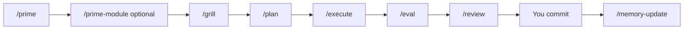

# cursor-workflow

A **Cursor AI workflow** you can drop into any project: slash-command skills, durable memory, and hooks that run automatically. No vendor lock-in to a specific stack — works with Node, Python, Go, Rails, Laravel, or anything else.

Think of it as a daily rhythm for building with AI: **orient → clarify → plan → build → verify → review → learn**.

---

## What you get

| Piece | What it does |
|---|---|
| **Skills** (`/grill`, `/plan`, …) | Repeatable workflows you trigger in chat |
| **Rules** (`.cursor/rules/*.mdc`) | Short constraints Cursor loads when you edit matching files |
| **Memory** (`memory/features/`, `AGENTS.md`) | Knowledge that survives across sessions |
| **Hooks** | Session start context, session logs, commit hygiene, **maintain-memory** queue |

Want the quick payoff first? Open `sample/README.md` for a runnable project/task demo plus example artifacts from every workflow skill.

## Architecture

Cursor discovers project-specific AI behavior from an app repo's `.cursor/` directory. This workflow can supply that directory in two ways: either by symlinking `.cursor` to a central `cursor-workflow/projects/<project>` folder, or by copying those files directly into the app repo.

The moving parts are:

| Layer | Location | Purpose |
|---|---|---|
| **App code** | your app repo | Product source, tests, migrations, package files, etc. |
| **Project workflow** | `.cursor/` in the app repo, or `cursor-workflow/projects/<project>` when symlinked | Project skills, rules, docs, plans, feature memory, and hook state |
| **Shared workflow engine** | `cursor-workflow/hooks/`, `templates/`, `skills-cursor/` | Reusable hooks, scaffolds, and authoring skills |
| **Local learned memory** | `AGENTS.md` in the app repo | Cross-cutting conventions maintained by `/maintain-memory` |

Why symlinks exist: they let one version-controlled workflow repo serve many app repos while keeping app git history focused on product code. The app still has `.cursor`, but it points to `cursor-workflow/projects/<project>` instead of storing the files physically in the app repo.

How the pieces relate:

- **Skills** are slash-command workflows such as `/prime`, `/prime-module`, `/grill`, `/plan`, and `/execute`.
- **Rules** are short Cursor instructions in `.cursor/rules/*.mdc`; `000-project-context.mdc` is always loaded.
- **Docs and memory** give skills deeper project context on demand, usually under `.cursor/docs/` and `.cursor/memory/`.
- **Hooks** run automatically on session and shell events. They surface context, append session notes, queue maintain-memory work, and guard commits in this workflow repo.

---

## Choose an install mode

### Mode 1: central workflow repo with `.cursor` symlink

Use this when you want all project workflow files and memories in one central repo. This is the default.

```bash
git clone https://github.com/DevYunus/Cursor-AI-workflow.git ~/cursor-workflow
cd ~/cursor-workflow

# Preview
./install.sh --dry-run

# Wire global hooks + symlink projects/example → your app's .cursor
APP_ROOT=~/code/my-app PROJECT=example ./install.sh --apply

# Restart Cursor completely (Cmd+Q, reopen)
```

Result:

```text
my-app/
├── src/ ...
├── AGENTS.md
└── .cursor  ->  ~/cursor-workflow/projects/example
```

The installer adds `.cursor` to `my-app/.git/info/exclude`, so the symlink stays local and app git does not try to commit it. If you also want learned `AGENTS.md` patterns to stay local, add `AGENTS.md` to the app repo's `.gitignore`.

### Mode 2: copy workflow files into the app repo

Use this when the app repo should own and commit its Cursor workflow directly. No `.cursor` symlink is created.

```bash
git clone https://github.com/DevYunus/Cursor-AI-workflow.git ~/cursor-workflow
cd ~/cursor-workflow

# Preview
APP_ROOT=~/code/my-app PROJECT=example ./install.sh --mode copy --dry-run

# Copy project skills/rules/docs/memory plus hook scripts into my-app/.cursor
APP_ROOT=~/code/my-app PROJECT=example ./install.sh --mode copy --apply

# Restart Cursor completely (Cmd+Q, reopen)
```

Result:

```text
my-app/
├── src/ ...
├── .gitignore
├── AGENTS.md
└── .cursor/
    ├── hooks.json
    ├── hooks/
    ├── rules/
    ├── skills/
    ├── docs/
    └── memory/
```

The installer keeps `.cursor/` trackable, but adds volatile local state to `.gitignore`: `.cursor/hooks/state/maintain-memory-pending.jsonl`, `.cursor/memory/sessions/`, and `AGENTS.md`.

### Customize for your project

```bash
cp -r projects/example projects/my-app
# Edit projects/my-app/rules/000-project-context.mdc (stack, conventions)
APP_ROOT=~/code/my-app PROJECT=my-app ./install.sh --apply
```

For direct-copy mode, use the same project slug with `--mode copy`:

```bash
APP_ROOT=~/code/my-app PROJECT=my-app ./install.sh --mode copy --apply
```

---

## Your daily loop

Type these in Cursor chat, in order, for any non-trivial task:

```
/prime        →  where are we? (git, open work)
/prime-module →  deep-dive one area (rules, docs, git, memory, prior plans)
/grill        →  clarify requirements (7 questions → brief file)
/plan         →  implementation plan + test gates
/execute      →  code changes, test after each task
/eval         →  does it actually meet success criteria?
/review       →  4 specialist reviewers on your diff
YOU commit    →  you run git, not the agent
/memory-update → after deploy: update feature memory
/maintain-memory → promote session learnings to AGENTS.md
```



**Hooks run in the background:**

- **sessionStart** — lists docs and skills available this session
- **sessionEnd** — appends a line to `memory/sessions/YYYY-MM-DD.md`
- **stop → maintain-memory** — queues the session transcript and prompts you to run `/maintain-memory`
- **beforeShellExecution** — on commits *inside cursor-workflow only*, requires a `Context:` section with bullets (keeps harness commits auditable)

---

## See the value right away

The `sample/` folder is a complete tour:

- `sample/project-tasks-app/` is a richer SaaS workflow with projects, tasks, roles, due dates, status transitions, and audit logs.
- `sample/workflow-artifacts/project-tasks/` shows how the full workflow handles that feature.
- `sample/workflow-artifacts/00-skill-map.md` lists every skill/agent this repo offers.
- `sample/tiny-contact-app/` remains as a tiny smoke demo.

Run the flagship sample app:

```bash
cd sample/project-tasks-app
npm test
```

Or install the workflow into the sample app:

```bash
APP_ROOT="$PWD/sample/project-tasks-app" PROJECT=example ./install.sh --mode copy --apply
```

Then restart Cursor, open `sample/project-tasks-app`, and try `/prime`, `/prime-module api`, and `/grill build project and task creation`.

---

## Example: build project and task management

The flagship sample is a small SaaS workflow: managers can create projects, add tasks, assign them to workspace members, enforce due dates, move tasks through valid statuses, and write audit logs.

That is big enough for the whole workflow. It has permissions, validation, state transitions, side effects, and regression tests.

### 1. Orient (~1 min)

Open your app in Cursor. In chat:

```
/prime
/prime-module api
```

`/prime` reads recent commits and summarizes what’s in flight. `/prime-module api` rehydrates module context: rules, docs, git history, feature memory, and prior plans. You say:

> Build project and task creation for a workspace app.

### 2. Interrogate (~5 min)

```
/grill build-project-task-management
```

The agent walks **7 categories** (one question at a time):

1. **Problem** — “Users need project and task creation inside a workspace.”
2. **Success criteria** — managers/admins create projects; task assignees must be members; audit logs exist.
3. **Scope IN** — in-memory domain logic, role checks, due-date validation, status transitions, tests.
4. **Scope OUT** — UI, database persistence, auth middleware, notifications.
5. **Code impact** — `sample/project-tasks-app/src/project-tasks.js`, `test/project-tasks.test.js`.
6. **Risks** — privilege escalation, tasks assigned outside workspace, missing audit entries.
7. **Rollback** — remove the sample folder and workflow artifacts.

When you’re satisfied:

```
ENOUGH
```

It writes `plans/build-project-task-management.brief.md` in your workflow repo.

### 3. Plan (~3 min)

```
/plan
```

Four explore sub-agents run in parallel: which files change, which interfaces are affected, which tests exist, and what prior memory says. You get `plans/build-project-task-management.plan.md` with tasks like:

- Task 1: Create the sample app shell
- Task 2: Implement project creation with role + uniqueness validation
- Task 3: Implement task creation with assignment + due-date validation
- Task 4: Implement status transitions and audit logging

Each task lists a **test command** (`npm test`, `pytest`, etc. — you set this in your Tier-1 rule).

### 4. Build (~15 min)

```
/execute
```

The agent edits files, runs tests after **each** task, and writes `execution-report.md`. It does **not** commit.

### 5. Verify outcome (~2 min)

```
/eval
```

Tests might pass while the product still fails (for example, task creation works but audit logs are missing). `/eval` checks the brief’s success criteria and writes PASS/FAIL per criterion.

### 6. Review (~3 min)

```
/review
```

Four reviewers (correctness, tests, security, maintainability) scan `git diff`. You fix anything critical, then **you** commit:

```bash
git add .
git commit -m "feat: add project task workflow sample"
git push
```

### 7. Learn (after deploy)

```
/memory-update
```

Appends to `memory/features/project-tasks/changelog.md` and `lessons.md`:

> State-changing SaaS workflows need permissions, validation, status transitions, and audit logs in the brief before implementation.

End of session:

```
/maintain-memory
```

Promotes cross-cutting patterns into `AGENTS.md` (e.g. “role-gated workflows need explicit negative tests and audit checks”).

**Total:** ~45 minutes for a feature that is easy to under-spec if you skip requirements and review.

---

## Folder map

```
cursor-workflow/
├── README.md                 ← you are here
├── install.sh / uninstall.sh
├── hooks.json.tmpl           → rendered to hooks.json at install
├── hooks/                    sessionStart, sessionEnd, maintain-memory, git commit guard
├── sample/                   runnable demos + skill output tour
├── templates/                brief, plan, handoff scaffolds
├── skills-cursor/            create-skill, create-rule, create-hook
└── projects/
    └── example/              copy → projects/<your-app>
        ├── rules/            Tier-1 + optional Tier-2 .mdc
        ├── skills/           /prime, /prime-module, /grill, /plan, …
        ├── docs/             deep reference (loaded on demand)
        ├── memory/features/  durable per-feature knowledge
        ├── plans/            briefs, plans, reports
        ├── handoffs/         session handoff notes
        └── hooks/state/      maintain-memory queue + learning index
```

Your app repo after symlink-mode install:

```
my-app/
├── src/ ...                  your code
├── AGENTS.md                 auto-updated learnings (optional, gitignored)
└── .cursor  →  ~/cursor-workflow/projects/my-app
```

Your app repo after copy-mode install:

```
my-app/
├── src/ ...                  your code
├── AGENTS.md                 auto-updated learnings (gitignored by installer)
└── .cursor/
    ├── hooks.json            project-level Cursor hook config
    ├── hooks/                copied hook scripts + local hook state
    ├── rules/                project instructions
    ├── skills/               slash-command workflows
    ├── docs/                 reference docs
    └── memory/               feature memory and session notes
```

---

## Customization checklist

1. **Copy** `projects/example` → `projects/<slug>`.
2. **Edit** `rules/000-project-context.mdc` — stack, test commands, conventions.
3. **Add Tier-2 rules** — e.g. `api.mdc` with `globs: src/api/**`.
4. **Seed memory** — `memory/features/<area>/overview.md` for modules you touch often.
5. **Re-run install** with `PROJECT=<slug>` and `APP_ROOT=<path>`.
6. **Optional:** add `testing.mdc`, `docs/patterns/testing.md`, reference with `@.cursor/docs/...` in the rule body.

---

## Commit message guard (workflow repo only)

When you commit changes **inside cursor-workflow**, the hook requires:

```
chore: update grill skill

Context:
- projects/example/skills/grill/SKILL.md: clarified ENOUGH exit
```

Your **app repo** is unaffected — commit normally there.

---

## FAQ

**Do I need extra MCP servers?**  
No. Skills mention optional tools (issue trackers, error trackers) if you have them; the core loop works with git + files only.

**Can I use only some skills?**  
Yes. `/grill` + `/plan` alone already beats vibe-coding for medium tasks.

**Where do plans live?**  
In symlink mode, under `cursor-workflow/projects/<project>/plans/`. In copy mode, under your app repo's `.cursor/plans/`.

**What is maintain-memory vs memory-update?**  
- **`/memory-update`** — curated, human-triggered, **after ship**, per feature folder.  
- **`/maintain-memory`** — automatic queue from the **stop** hook; extracts reusable bullets into **`AGENTS.md`**.

---

## License

MIT — use, fork, and adapt for your team.
